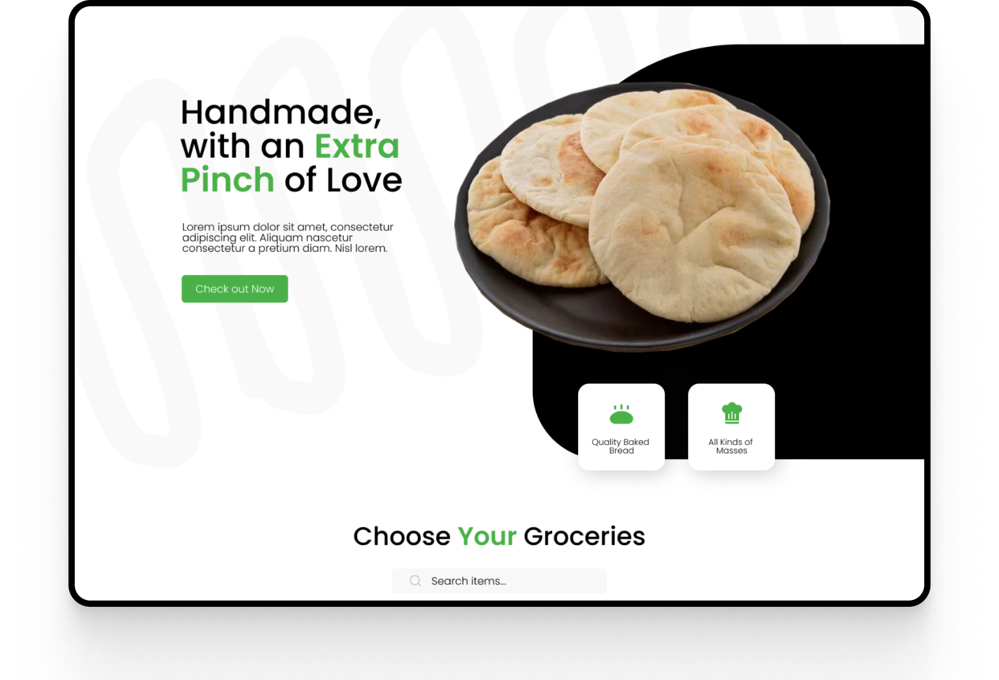

<h1 align="center">Grocom Lite 🌾</h1>

Grocom Lite is a free HubSpot CMS theme to create Ecommerce solutions, this theme is highly focused on Grocery themed stores. Despite being focused in Grocery, you can use the Grocom Lite theme to create various websites for ecommerce companies, professional services, and non-profit associations.

  <a href="https://ecosystem.hubspot.com/marketplace/website/grocom-lite-theme-theme-by-remotish">Marketplace</a> |
  <a href="https://marketplace.remotish.agency/grocom-lite-theme">Demo website</a> |
  <a href="./LICENSE">License</a>

## Free and Open Source Theme
It's a free and open-source theme made by me and with help of Remotish Agency, designed in Figma to be modern, clean and developed with optimization in mind.

This theme incorporates the best practice recommendations and code formatting of the HubSpot CMS Boilerplate open-source theme.

## 📄 License

Permissions of this strong copyleft license are conditioned on making available complete source code of licensed works and modifications, which include larger works using a licensed work, under the same license. Copyright and license notices must be preserved. Contributors provide an express grant of patent rights.

| Permissions | Restrictions | Conditions
| --- | --- | --- 
&check; Commercial Use | &times; Liability | &#x1f6c8; License and Copyright Notice
&check; Modification   | &times; Warranty | &#x1f6c8; State changes
&check; Distribution |  | &#x1f6c8; Disclose source
&check; Patent Use |  | &#x1f6c8; Same license
&check; Private Use
